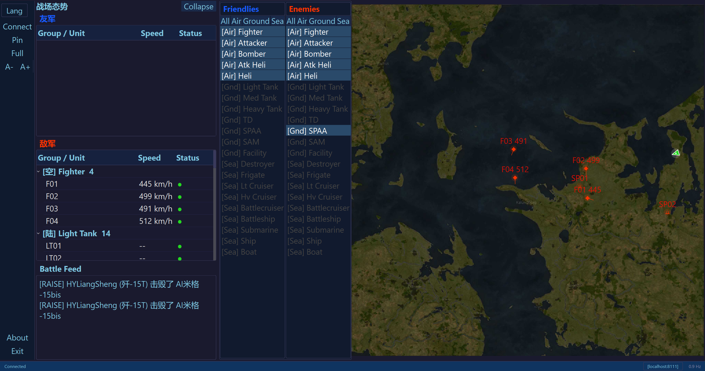

# WTDashboard — War Thunder Tactical Dashboard

<p align="center">English | <a href="README_zh.md">简体中文</a></p>

A real-time tactical display for War Thunder, built with PyQt6. Reads battlefield data via the game's local API (port 8111), showing a live map with unit positions, calculated horizontal target speeds, last-known positions of lost targets, a situation report panel, and HUD messages — ideal for a secondary monitor or another PC on the LAN.

## Features

- **Live Map** — renders the in-game tactical map with tracked unit icons, speed labels, and fading "lost" markers
- **Situation Report** — units grouped by type (Fighter, MBT, Destroyer, etc.) with speed & status, expandable tree view
- **Battle Feed** — scrolling HUD damage/kill messages
- **Filter Bar** — toggle visibility by faction (friendly/enemy) and vehicle type
- **Multi-language** — English / Simplified Chinese, drop a JSON file into `locales/` to add new languages, or submit a PR
- **Custom Icons** — replace any PNG in `game_icons/` to change unit markers
- **Font Scaling** — A+/A- buttons in the sidebar adjust all UI text dynamically
- **Always-on-Top & Fullscreen** — for dedicated second-screen use
- **Remote Mode** — run on a different PC on the same LAN

## Screenshot



## Installation

### Download

Grab the latest **`WTDashboard_Setup.exe`** from [Releases](../../releases) — it installs everything into `%LOCALAPPDATA%\WTDashboard` with Start Menu and Desktop shortcuts.

### Run from Source

```bash
pip install -r requirements.txt
python main.py
```

### Enable WT Remote Access

In War Thunder, go to **Options → Main parameters → Air Battle settings** (or Ground/Naval) and set:

- *Allow remote access* → **Yes**
- *Port* → **8111** (default)

## Project Structure

```
WTDashboard/
├── main.py              # Entry point
├── wtdb/                # Application package
│   ├── dashboard_window.py   # Main window, sidebar, filter bar
│   ├── map_widget.py         # Tactical map rendering
│   ├── sitrep_panel.py       # Situation report tree
│   ├── hud_feed.py           # HUD message feed
│   ├── unit_tracker.py       # Unit tracking & ghost logic
│   ├── api_client.py         # WT 8111 API client
│   ├── i18n.py               # Multi-language engine
│   ├── styles.py             # Dark theme QSS
│   └── config.py             # JSON config save/load
├── game_icons/          # Vehicle type icons (replaceable PNGs)
├── locales/             # Language packs (JSON)
├── setup.nsi            # NSIS installer script
├── WTDashboard.spec     # PyInstaller spec
└── icon.png / icon.ico  # App icon
```

## Build

Requires [NSIS](https://nsis.sourceforge.io/) and Python 3.11+ with PyQt6.

```bash
# 1. Build the EXE
pip install pyinstaller
pyinstaller --noconfirm WTDashboard.spec

# 2. Build the installer
makensis setup.nsi
```

The output is `dist/WTDashboard_Setup.exe`.

## License

MIT — see [LICENSE](LICENSE).
