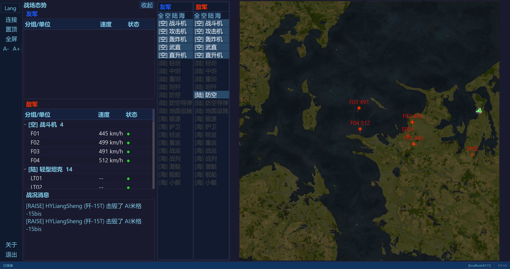

# WTDashboard — 战争雷霆战术看板

<p align="center"><a href="README.md">English</a> | 简体中文</p>

基于 PyQt6 的战争雷霆实时战术显示工具。通过游戏本地 API（8111 端口）读取数据，实时显示地图上的单位位置、计算水平目标速度、记录失踪目标最后出现的位置、战局态势感知面板和 HUD 消息——适合副屏或局域网内另一台电脑使用。

## 功能

- **实时地图** — 渲染游戏内战术地图，叠加追踪单位图标、速度标签和渐隐的"已失踪"标记
- **态势感知** — 按类型分组（战斗机、主战坦克、驱逐舰等），显示速度与状态，可展开的树形视图
- **战况消息** — 滚动显示 HUD 伤害/击杀信息
- **筛选栏** — 按阵营（友军/敌军）和载具类型切换显示
- **多语言** — 英文 / 简体中文，新的语言支持可放入 JSON 文件到 `locales/` ，也可向我提交 PR
- **自定义图标** — 替换 `game_icons/` 中的 PNG 即可更改单位标记
- **字号缩放** — 侧边栏 A+/A- 按钮动态调整全局字号
- **窗口置顶 & 全屏** — 适合专用副屏
- **远程模式** — 可在局域网内另一台电脑上运行

## 截图



## 安装

### 下载安装包

从 [Releases](../../releases) 下载最新的 **`WTDashboard_Setup.exe`**，安装到 `%LOCALAPPDATA%\WTDashboard`，自动创建开始菜单和桌面快捷方式。

### 从源码运行

```bash
pip install -r requirements.txt
python main.py
```

## 项目结构

```
WTDashboard/
├── main.py              # 入口
├── wtdb/                # 应用包
│   ├── dashboard_window.py   # 主窗口、侧边栏、筛选栏
│   ├── map_widget.py         # 战术地图渲染
│   ├── sitrep_panel.py       # 态势感知树
│   ├── hud_feed.py           # HUD 消息流
│   ├── unit_tracker.py       # 单位追踪与幽灵逻辑
│   ├── api_client.py         # WT 8111 API 客户端
│   ├── i18n.py               # 多语言引擎
│   ├── styles.py             # 暗色主题 QSS
│   └── config.py             # JSON 配置读写
├── game_icons/          # 载具类型图标（可替换 PNG）
├── locales/             # 语言包（JSON）
├── setup.nsi            # NSIS 安装脚本
├── WTDashboard.spec     # PyInstaller 配置
└── icon.png / icon.ico  # 应用图标
```

## 构建

需要 [NSIS](https://nsis.sourceforge.io/) 和 Python 3.11+ 及 PyQt6。

```bash
# 1. 构建 EXE
pip install pyinstaller
pyinstaller --noconfirm WTDashboard.spec

# 2. 构建安装包
makensis setup.nsi
```

产物为 `dist/WTDashboard_Setup.exe`。

## 许可证

MIT — 详见 [LICENSE](LICENSE)。
